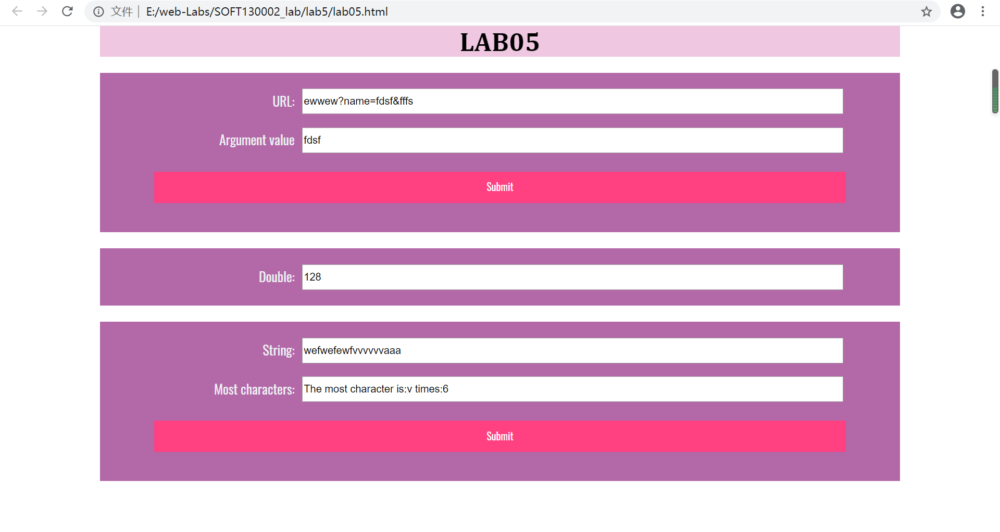
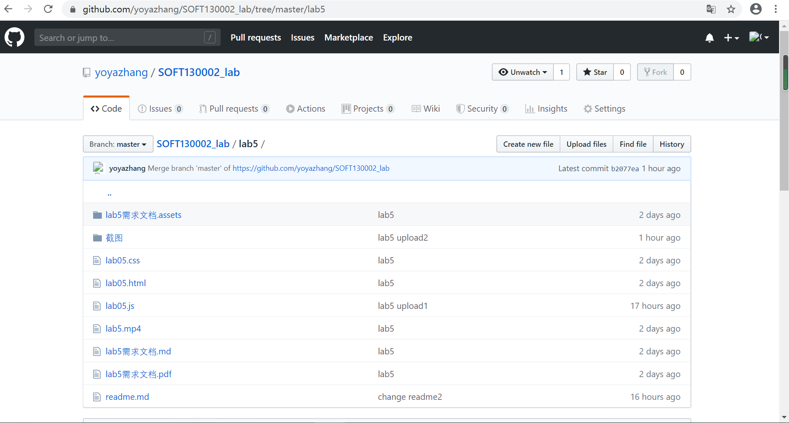

lab5设计文档
=====
## 第一个函数
通过for循环将url中的每个字符放在一个数组里，再通过for循环判断数组中是否连续出现"n""a""m""e""=",如果有则记下n的位子为index，接着
在url.value中寻找indexOf("&",index)并记为lastIndex，如果为-1（即&不存在）则将url_result.value设为url.value.substring(index);如果&存在，
则将url_result.value设为url.value.substring(index,lastIndex);
如果name=不存在，则设为“no name" 
## 第二个函数
创建t1计时器window.setInterval(timeTest,5000)使其每5秒执行一次加倍函数（即timetest），同时创建第二个计时器t2使其每秒运行一次，检查mul.value
是否为1024（即执行了十次）或者当前时间是否是整分钟（new Date().getSeconds % 60 == 0)满足其一即停止第一个计时器（window.clearInterval(t1);） 
## 第三个函数
同样通过for循环将most中的每个字符放在一个数组charList里，再通过二重循环统计每个字符出现的次数放在数组times里，最后进行依次判断，找到出现次数
最多的字符的index,将max设为最多出现的次数,将result.value设为"The most character is:" + charList[index] + " times:" + max; 
## 效果图
 
 
